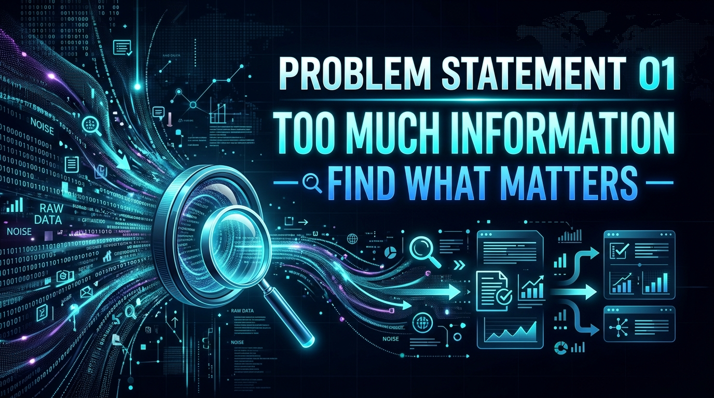

  

<h1 align="center">🧠 PROBLEM STATEMENT 01</h1>
<h2 align="center">Find What Matters</h2>

  
  
  

---

## 🎯 Background

The web contains a huge amount of information. A single webpage can include headings, paragraphs, images, advertisements, navigation menus, user comments, links, tables, and cluttered sidebar elements.

When users visit such pages, finding the specific information they actually need can take a lot of time and cognitive effort.

* For example, a **student** reading a long research article may only want the core findings and key points.
* A **shopper** comparing products across multiple pages may only want price, specs, and stock availability.
* A **developer or engineer** reading technical documentation may want a specific code snippet or API parameter explanation without scrolling through thousands of lines.

---

## ⚡ Challenge Statement

Build a **Chrome Extension** that helps users quickly identify, extract, organize, or interact with the most relevant information on the current webpage.

Your extension should make it significantly easier for a user to understand, navigate, or find useful information without manually scanning through the entire webpage.

---

## 📋 Core Requirements

Your solution must:

1. **Work as a Chrome Extension** (using Manifest V3 standards).
2. **Operate on the currently opened webpage** dynamically using Content Scripts, Side Panels, or Extension Popups.
3. **Provide a clear mechanism** for the user to identify, extract, or interact with relevant information.
4. **Have a functional and understandable user interface** (popup, overlay, sidebar, or inline highlighters).
5. **Demonstrate a meaningful solution** to the problem of information overload.

---

## 💡 What Can You Build?

Your team can explore directions such as:

| Direction / Concept | How It Solves Information Overload |
|---|---|
| 🔎 **Intelligent Discovery** | Smart search that highlights and navigates to contextual answers rather than exact keyword matches. |
| ✨ **Visual Focus & Highlighting** | Automatically dim clutter, ads, and sidebars while highlighting core concepts or key sentences. |
| 📝 **Smart Summarization** | Instantly summarize lengthy articles, blogs, or documentation into concise bullet points. |
| 📊 **Structured Data Extraction** | Automatically detect and pull tables, specifications, pricing, key specs, or contacts into a clean overlay. |
| 🤖 **Interactive Reading Assistant** | Allow users to chat with the page content, ask questions, and receive inline answers. |
| 🔖 **Knowledge Clipper & Organizer** | Save, categorize, and tag key snippets from the page into organized note cards. |
| ⚖️ **Multi-Tab Comparison** | Compare specs or information across open tabs in a unified side-by-side view. |

> [!TIP]
> **Innovation Notice**: The ideas above are starting points to ignite your creativity. You are encouraged to design your own unique, innovative solution!

---

## 🏆 Evaluation Matrix

| Evaluation Criteria | What Judges Look For in PS-01 |
|---|---|
| 🎯 **Problem Understanding** | How effectively does the extension eliminate noise and highlight what matters? |
| 💡 **Innovation & Approach** | Is the method of extracting or presenting information clever and unique? |
| ⚙️ **Technical Execution** | How smoothly does the script parse page DOM / content and render UI elements? |
| 👥 **Practical Usefulness** | Would an everyday web user benefit from installing this extension? |
| 🎨 **UI / UX Design** | Is the interface sleek, non-intrusive, and easy to navigate? |
| ✅ **Functionality (MVP)** | Does the live demo perform reliably on live websites during judging? |
| 🎤 **Presentation & Code QA** | Can the team explain their implementation and answer technical questions? |

---

## ⚠️ Important Guidelines

> [!IMPORTANT]
> The goal is **not** to build a complex, commercial-grade product. Focus on building a functional and meaningful Minimum Viable Product (MVP) that clearly demonstrates your core concept within the given time.

---

## 🔗 Navigation

* 🏠 [**Back to Event Homepage (README)**](./README.md)
* 🛡️ [**View Problem Statement 02**](./PS-02-Think-Before-You-Click.md)
* 📘 [**Read Common Rules**](./COMMON-RULES.md)
* 📝 [**Read Submission Guidelines**](./SUBMISSION-GUIDELINES.md)

---

<i>EXTEND-X 2026 — Problem Statement 01</i>

