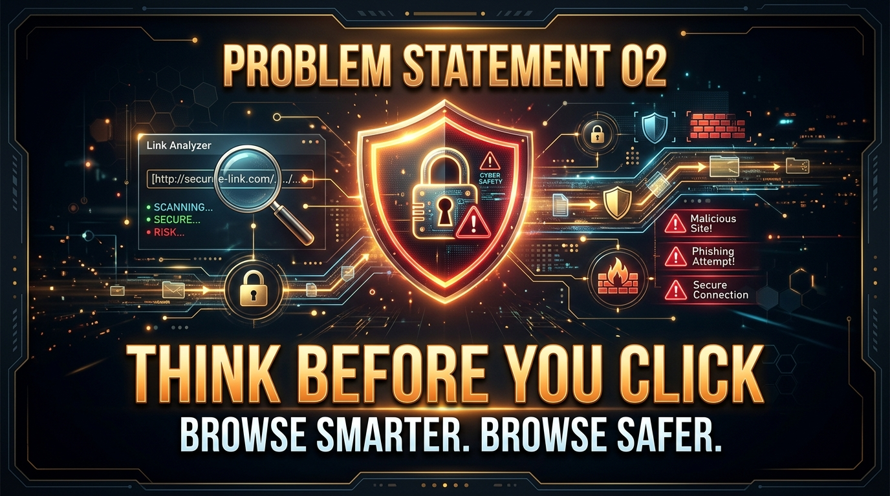

  

<h1 align="center">🛡️ PROBLEM STATEMENT 02</h1>
<h2 align="center">Think Before You Click — Browse Smarter. Browse Safer.</h2>

  
  
  

---

## 🎯 Background

Every day, users interact with hundreds of links, websites, advertisements, file downloads, and online forms while browsing the internet.

However, it is not always easy for average web users to determine whether a link or website is safe, suspicious, misleading, or potentially harmful **before** clicking or submitting sensitive data.

* Users may unknowingly click on **typosquatted URLs** or deceptive phishing links embedded in emails or web pages.
* Users may visit cloned sign-in portals that mimic official services to harvest credentials.
* Users may download executable files disguised as PDFs or documents from untrusted domains.
* Misleading "Download Now" or "Claim Offer" banner ads trick users into interacting with unwanted software.

---

## ⚡ Challenge Statement

Build a **Chrome Extension** that helps users make safer decisions while browsing the web by identifying, analyzing, or warning users about potentially risky web content.

Your extension should provide actionable insight, clear risk indicators, or preventative assistance **before or while** the user interacts with suspicious content.

---

## 📋 Core Requirements

Your solution must:

1. **Work as a Chrome Extension** (using Manifest V3 standards).
2. **Analyze or interact with content** from the active webpage, link targets, form elements, or browsing context.
3. **Provide a clear visual indication, warning, risk score, or explanation** to the user.
4. **Have a functional and understandable user interface** (hover tooltips, page overlays, popup indicators, or badges).
5. **Demonstrate a meaningful approach** to improving web browsing safety.

---

## 💡 What Can You Build?

Your team can explore directions such as:

| Direction / Concept | How It Enhances Web Browsing Safety |
|---|---|
| 🔗 **Link Pre-Check & URL Inspection** | Inspect links on hover for shortened URLs, domain mismatches, suspicious TLDs, or hidden redirects. |
| 🎣 **Phishing & Form Safeguard** | Detect fake login forms, insecure HTTP password inputs, or suspicious domain cloning patterns. |
| 🛡️ **Real-Time Trust & Risk Score** | Calculate a dynamic safety score for the current site using domain age, SSL status, and content markers. |
| ⚠️ **Download & File Risk Alert** | Alert users when hovering over or initiating file downloads with hazardous file extensions (.exe, .scr, .vbs). |
| 💡 **Plain-English Risk Explanations** | Explain *why* a site or link is flagged in simple, non-technical language so users learn safer browsing habits. |
| 👁️ **Deceptive UI & Ad Highlighter** | Automatically highlight misleading 'Fake Download' buttons or deceptive ad links on a page. |

> [!TIP]
> **Innovation Notice**: The ideas above are starting points to inspire your team. You are encouraged to design your own unique, innovative approach to browser security!

---

## 🏆 Evaluation Matrix

| Evaluation Criteria | What Judges Look For in PS-02 |
|---|---|
| 🎯 **Problem Understanding** | Does the extension effectively identify real safety risks faced by web users? |
| 💡 **Innovation & Approach** | Is the detection mechanism, risk rating, or user warning visually smart and creative? |
| ⚙️ **Technical Execution** | Does the extension analyze DOM elements, URLs, or APIs accurately without freezing the page? |
| 👥 **Practical Usefulness** | Does it empower everyday users to browse more safely without overwhelming them with false alarms? |
| 🎨 **UI / UX Design** | Are security warnings prominent, clear, and easy to interpret at a glance? |
| ✅ **Functionality (MVP)** | Does the extension reliably detect flagged links/sites during the live presentation? |
| 🎤 **Presentation & Code QA** | Can the team clearly explain how their analysis logic works under the hood? |

---

## ⚠️ Important Guidelines

> [!IMPORTANT]
> The goal is **not** to build a enterprise commercial antivirus engine. Focus on creating a working and meaningful Minimum Viable Product (MVP) that clearly demonstrates your safety solution within the given time.

---

## 🔗 Navigation

* 🏠 [**Back to Event Homepage (README)**](./README.md)
* 🧠 [**View Problem Statement 01**](./PS-01-Too-Much-Information.md)
* 📘 [**Read Common Rules**](./COMMON-RULES.md)
* 📝 [**Read Submission Guidelines**](./SUBMISSION-GUIDELINES.md)

---

<i>EXTEND-X 2026 — Problem Statement 02</i>

