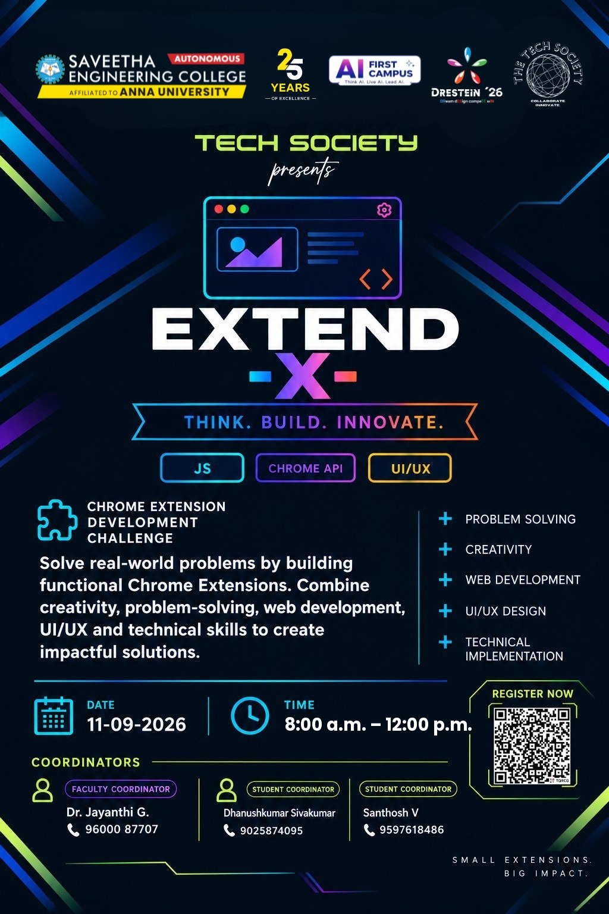

<p align="center">
  
</p>

<h1 align="center">⚡ EXTEND-X 2026</h1>
<p align="center">
  <b>CHROME EXTENSION CHALLENGE</b><br>
  <i>Build • Create • Innovate</i>
</p>

<p align="center">
  <a href="#-badges"></a>
  <a href="#-event-details"></a>
  <a href="#-event-details"></a>
  <a href="#-event-details"></a>
  <a href="#-event-details"></a>
</p>

---

## 🎯 The Challenge

Welcome to **EXTEND-X 2026**, the official Chrome Extension Challenge at Saveetha Engineering College!

Your task is to **build a functional Chrome Extension** that solves a real-world web browsing problem. Choose **ONE** of the two official problem statements below, transform your concept into a working Minimum Viable Product (MVP), and showcase your innovation to our panel of judges.

---

## 🧩 Choose Your Challenge

Select one of the problem statements below to explore full details, requirements, and evaluation guidelines:

<table>
<tr>

<td width="50%" align="center" style="padding: 20px;">

<h2>🧠 PROBLEM STATEMENT 01</h2>

<h3><b>Find What Matters</b></h3>

<p>
Turn information overload into useful, accessible, and structured insights for users navigating dense web pages.
</p>

<br>

<a href="./PS-01-Find-What-Matters.md">
  
</a>

</td>

<td width="50%" align="center" style="padding: 20px;">

<h2>🛡️ PROBLEM STATEMENT 02</h2>

<h3><b>Think Before You Click</b></h3>

<p><i>Browse Smarter. Browse Safer.</i></p>

<p>
Empower users to make safer decisions online by identifying, analyzing, and warning against potentially risky web content.
</p>

<br>

<a href="./PS-02-Think-Before-You-Click.md">
  
</a>

</td>

</tr>
</table>

---

## 🚀 Your EXTEND-X Journey

```text
┌─────────────────┐       ┌─────────────────┐       ┌─────────────────┐       ┌─────────────────┐
│   01 EXPLORE    │  ──►  │    02 CHOOSE    │  ──►  │    03 BUILD     │  ──►  │     04 DEMO     │
│ Read both PS    │       │ Select 1 PS     │       │ Create Chrome   │       │ Present & Demo  │
│ carefully       │       │ for your team   │       │ Extension MVP   │       │ your working MVP│
└─────────────────┘       └─────────────────┘       └─────────────────┘       └─────────────────┘
```

1. **01 — EXPLORE**: Read both problem statements carefully to understand the context and requirements.
2. **02 — CHOOSE**: Select **ONE** problem statement that best matches your team's idea and technical capabilities.
3. **03 — BUILD**: Develop a working Chrome Extension MVP within the designated hackathon timeline.
4. **04 — DEMO**: Demonstrate your live extension and present your implementation to the judges.

---

## 📋 Quick Rules & Policies

<details>
<summary><b>🤖 AI Tool Usage</b></summary>
<br>
AI tools such as <b>ChatGPT, Gemini, Claude, GitHub Copilot, Cursor</b>, and other AI-assisted development tools are permitted.
</details>

<details>
<summary><b>🚫 Originality & Fair Play</b></summary>
<br>
Copying another team's solution or submitting pre-existing projects is strictly prohibited. All submitted solutions must be developed during the official event window after the problem statement reveal.
</details>

<details>
<summary><b>🔌 External APIs & Libraries</b></summary>
<br>
External APIs, open-source libraries, datasets, and third-party services are allowed. Teams must explicitly disclose all external services used during their final presentation.
</details>

<details>
<summary><b>🎯 Realistic Scope & MVP Focus</b></summary>
<br>
The goal is to build a functional Minimum Viable Product (MVP) that clearly demonstrates your core concept. Focus on delivering a polished, working solution for the core problem rather than an incomplete list of excessive features.
</details>

---

## 🏆 Evaluation Focus

Submissions will be evaluated across seven core dimensions:

| Criteria | What We Look For |
|---|---|
| 🎯 **Problem Understanding** | Does the solution accurately address the selected Problem Statement? |
| 💡 **Innovation & Creativity** | Is the technical approach novel, creative, and well-thought-out? |
| ⚙️ **Technical Implementation** | Is the extension well-coded, functional, and leveraging extension APIs efficiently? |
| 👥 **Usefulness & Relevance** | Does it solve a real user pain point in everyday web browsing? |
| 🎨 **User Experience (UX/UI)** | Is the interface intuitive, clean, and seamless for the user? |
| ✅ **Functionality** | Does the MVP work reliably during live testing without critical crashes? |
| 🎤 **Demonstration & Q&A** | Can the team clearly explain the architecture, logic, and live workflow? |

---

## 📚 Navigation & Event Documents

* 📘 [**COMMON RULES**](./COMMON-RULES.md) — Comprehensive rules regarding code compliance, AI usage, and integrity.
* 📝 [**SUBMISSION GUIDELINES**](./SUBMISSION-GUIDELINES.md) — Step-by-step checklist, demo structure, and presentation format.
* 🧠 [**PROBLEM STATEMENT 01**](./PS-01-Find-What-Matters.md) — Find What Matters.
* 🛡️ [**PROBLEM STATEMENT 02**](./PS-02-Think-Before-You-Click.md) — Think Before You Click (Browse Smarter. Browse Safer.).

---

<hr>

<p align="center">
  <b>BUILD • CREATE • INNOVATE 🚀</b><br>
  <i>EXTEND-X 2026 — Saveetha Engineering College</i>
</p>
